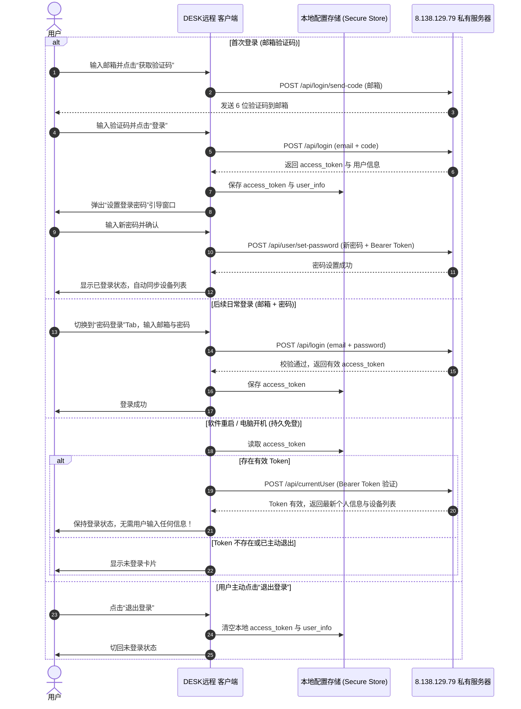

# “DESK远程” UU 风格全新界面重构执行方案 (Final Plan)

根据沟通与选择，已完成所有设计定稿与新增的**个人账号登录体系**规划。本次将对客户端界面执行全面重构，打造商业级、极简优雅的 **“左侧树状导航边栏 + 右侧卡片式工作台 + 个人账号系统”**。

---

## 一、 核心设计定稿规格

| 模块 | 定稿方案 | 详细规格 |
| :--- | :--- | :--- |
| **品牌名称** | **DESK远程** | 窗口标题、左上角 Logo 旁标、复制分享文案均统一使用“DESK远程” |
| **个人账号登录** | **邮箱验证码 / 密码登录 + 持久免登** | 1. 支持邮箱输入并获取验证码完成登录/注册；<br>2. 登录后可设置独立密码，后续可自由使用“邮箱+密码”直接登录；<br>3. 具备本地 Token 持久化存储机制，只要不主动点击“退出”，关闭重启软件无需重新登录；<br>4. 登录后自动云端漫游同步该账号下的所有受控设备。 |
| **侧边栏结构** | **用户头像卡片 + 双分组精简布局** | 顶部为【个人用户登录卡片】，主体为【我的设备】与【远程协助】，底部固定【设置 ⚙】 |
| **设备详情页** | **桌面大图 + 快捷条 + 快速启动** | 16:9 桌面壁纸预览卡片、快捷操作工具条（文件/观看/终端/映射）、快速启动卡片 |
| **快速启动功能** | **实用快捷指令** | 点击“➕ 添加”支持添加系统快捷操作（一键锁屏、重启、任务管理器、发送 Ctrl+Alt+Del 等） |
| **协助面板 (图2)** | **本设备卡片 + 伙伴连接卡片** | 允许协助开关、大字号 ID、临时密码点阵与眼睛切换/刷新、一键“复制并分享”、ID 直连 |
| **主题色彩** | **浅色纯白科技蓝 + 兼容暗黑模式** | 主色调科技蓝（`#1E6FFF`），圆角卡片（12~14px），微投影浮层，深色模式自动适配深灰 |

---

## 二、 界面布局与图文线框图 (Wireframes)

### 2.1 整体框架

```
+--------------------------------------------------------------------------------------------------+
|  [Logo] DESK远程                                                                      -  口  x   |
+---------------------+----------------------------------------------------------------------------+
| [👤 头像] 个人中心  |                                                                            |
|   未登录 / user@..  |   右侧动态工作台区域 (根据左侧选中项切换):                                 |
| ------------------- |                                                                            |
| ≡ 我的设备       ^  |   1. 选中具体设备项 -> 视图 A：【设备详情控制台】(图一)                    |
|   | 💻 DESKTOP-30.. |   2. 选中“全部设备” -> 视图 B：【全部设备网格卡片流】                      |
|   | 💻 LAPTOP-1TQ.. |   3. 选中“开始协助” -> 视图 C：【远程协助主控/受控面板】(图二)             |
|   | 💻 学校电脑     |   4. 选中“收藏设备” -> 视图 D：【收藏设备专属列表】                        |
|   | ∷ 全部设备      |   5. 点击个人中心 -> 视图 E：【个人登录与账号管理卡片】                    |
| 🖥 远程协助       ^  |                                                                            |
|   | 🔄 开始协助     |                                                                            |
|   | ★ 收藏设备      |                                                                            |
|                     |                                                                            |
| ⚙ 设置              |                                                                            |
+---------------------+----------------------------------------------------------------------------+
```

---

### 2.2 视图 A：设备详情控制台 (对应参考图 1)

当用户在左侧侧边栏点击 **【我的设备】中的任意一台电脑** 时：

```
+--------------------------------------------------------------------------------------------------+
|  ● 在线  DESKTOP-30T3OVH                                                  [ ⋮ 更多设置菜单 ]     |
|                                                                                                  |
|  +--------------------------------------------------------------------------------------------+  |
|  |                                                                                            |  |
|  |                           🖥 桌面实时缩略图 / Win11 几何壁纸卡片 (16:9)                    |  |
|  |                                (点击卡片直接发起全功能远程桌面连接)                        |  |
|  |                                                                                            |  |
|  +--------------------------------------------------------------------------------------------+  |
|  |   [📁 文件传输]   |   [▶ 观看模式]   |   [>_ 终端命令行]   |   [⮀ 端口映射]   |   [∷ 更多] |  |
|  +--------------------------------------------------------------------------------------------+  |
|                                                                                                  |
|  快速启动                                                                                        |
|  + - - - - - - - - - - - - - - - - - - - - - - - - - - - - - - - - - - - - - - - - - - - - - -+  |
|  |  [🔒 一键锁屏]    [⚡ 重启电脑]    [📊 任务管理器]    [⌨ Ctrl+Alt+Del]    [➕ 添加快捷]      |  |
|  + - - - - - - - - - - - - - - - - - - - - - - - - - - - - - - - - - - - - - - - - - - - - - -+  |
+--------------------------------------------------------------------------------------------------+
```

---

### 2.3 视图 C：远程协助主控/受控面板 (对应参考图 2)

当用户在左侧侧边栏点击 **【远程协助】->【开始协助】**（首次打开软件默认页面）：

```
+--------------------------------------------------------------------------------------------------+
| 远程协助                                                                                         |
|                                                                                                  |
| +----------------------------------------------------------------------------------------------+ |
| | 本设备                                                       允许他人远程协助 [ ●开关 (开) ]  |
| | -------------------------------------------------------------------------------------------- | |
| | 本设备ID                     验证方式: 仅使用临时验证码 ∨                                    | |
| |                                                                                              | |
| | 964 887 046                  ● ● ● ● ● ● ●    [👁]  [⚙]              [  复制并分享  ]        | |
| | (大字号/加粗/三位分段)       每次远控结束刷新                                                | |
| +----------------------------------------------------------------------------------------------+ |
|                                                                                                  |
| +----------------------------------------------------------------------------------------------+ |
| | 远控伙伴设备                                                                                 | |
| | 通过其他设备的【设备ID】及【设备验证码】启动远程控制                                         | |
| | -------------------------------------------------------------------------------------------- | |
| | 伙伴的设备ID                                                                                 | |
| | +--------------------------------------------+    +-----------------------+                  | |
| | | 请输入设备ID (支持自动去除空格)            |    |      连  接 (Button)  |                  | |
| | +--------------------------------------------+    +-----------------------+                  | |
| +----------------------------------------------------------------------------------------------+ |
+--------------------------------------------------------------------------------------------------+
```

---

### 2.4 视图 E：个人登录与账号管理体系 (全新加入)

#### 1. 侧边栏用户状态卡片
* **未登录状态**：显示轻灰质感默认头像，文本为“未登录”，点击弹出登录/注册浮窗；
* **已登录状态**：显示高质感圆形头像，显示用户邮箱（如 `user@domain.com`），附带绿色“在线”微标，点击呼出下拉操作菜单（*修改密码*、*同步设备*、*退出登录*）。

#### 2. 登录与注册弹窗线框图

```
+---------------------------------------------------------+
|                  登录 / 注册 DESK远程                   |
|                                                         |
|         [ 验证码登录 (Tab) ]       [ 密码登录 (Tab) ]   |
| ------------------------------------------------------- |
|                                                         |
|   邮箱地址                                              |
|   +---------------------------------------------------+ |
|   | 请输入您的邮箱账号 (如 name@example.com)          | |
|   +---------------------------------------------------+ |
|                                                         |
|   验证码 / 密码                                         |
|   +---------------------------------+ +---------------+ |
|   | 请输入 6 位验证码               | |  获取验证码   | |
|   +---------------------------------+ +---------------+ |
|                                                         |
|   [✔] 记住登录状态（不主动退出则保持登录）              |
|                                                         |
|   +---------------------------------------------------+ |
|   |                   登    录 (Button)               | |
|   +---------------------------------------------------+ |
|                                                         |
|   首次验证码登录后，将引导您设置密码，以后可凭密码直登   |
+---------------------------------------------------------+
```

#### 3. 设置登录密码浮层 (首次邮箱登录成功后自动弹出)

```
+---------------------------------------------------------+
|                      设置账号密码                       |
|   设置后，下次可直接使用【邮箱 + 密码】快捷登录          |
| ------------------------------------------------------- |
|   设置新密码: [••••••••              ] [👁]              |
|   确认新密码: [••••••••              ]                  |
|                                                         |
|   +--------------------------+  +---------------------+ |
|   |       稍后设置 (跳过)    |  |    保存并启用密码   | |
|   +--------------------------+  +---------------------+ |
+---------------------------------------------------------+
```

---

## 三、 个人登录状态与免重登时序流程



---

## 四、 功能对接与底层实现映射表

| 界面元素 | 触发行为 / 底层 API | 预期效果 |
| :--- | :--- | :--- |
| **“个人中心” 卡片** | 点击弹出登录对话框 / 个人资料抽屉 | 未登录弹出双模式登录框；已登录展示账号设置下拉 |
| **“邮箱验证码” 发送** | `gFFI.userModel.sendEmailCode(email)` | 触发服务器发信，客户端按钮进入 60s 倒计时状态 |
| **“设置密码” 对话框** | `gFFI.userModel.setPassword(newPassword)` | 调用接口修改当前账号独立密码，成功后提示已生效 |
| **“记住登录状态” (持久)** | `bind.mainSetLocalOption(key: 'access_token', value: token)` | 持久化写入宿主环境，每次软件启动自动恢复登录态 |
| **“设备列表漫游”** | `gFFI.abModel.pullAb()` / `gFFI.groupModel.pull()` | 登录后自动把账号在其他电脑登录绑定的设备拉取到【我的设备】 |
| **“允许他人远程协助” 开关** | 切换 `stop-service` 配置 / 启停本地 Server 侦听 | 开启时正常接收连接；关闭时断开现有受控并拒绝入站 |
| **“本设备ID”** | 绑定 `gFFI.serverModel.serverId` | 呈现大号醒目排版，带格式化分段；双击或点击即可复制 |
| **“复制并分享” 按钮** | `Clipboard.setData(text: "【DESK远程】我的设备ID：xxx，验证码：xxx")` | 复制到剪贴板并弹出顶部浮层提示“已复制分享信息” |
| **“验证码眼睛 / 刷新” 图标** | 切换 `obscurePassword` / 调用 `bind.mainUpdateTemporaryPassword()` | 密码明密文切换 / 重新生成一组强随机临时验证码 |
| **“快速启动快捷按钮”** | 发送远程控制协议特殊快捷键指令包 | 支持快速对远端机器执行锁屏、重启、调出任务管理器等 |
| **“文件传输 / 终端 / 映射”** | `connect(context, id, isFileTransfer: true...)` | 点击直接打开专属会话窗口（文件管理 / ConPTY 命令行） |

---

## 五、 分步实施执行计划

* **Step 1（左侧导航栏与用户卡片重构）**：重构 `desktop_home_page.dart`，打造包含品牌名、个人登录卡片、折叠设备树、协助入口和底部设置项的侧边栏。
* **Step 2（视图 E：个人登录与免密重登体系）**：实现邮箱验证码登录、设置密码、密码直连登录、持久 Token 保持与退出登录逻辑。
* **Step 3（视图 C：远程协助面板）**：完整还原参考图 2 的高质感受控卡片与伙伴连接卡片，实现“复制并分享”、ID 直连与临时密码交互。
* **Step 4（视图 A：设备详情工作台）**：开发大卡片预览、快捷操作工具条和快速启动卡片，实现一键穿透连接与快捷控制。
* **Step 5（全套配色美化与暗黑适配）**：统一样式为 `#1E6FFF` 蓝 + 圆角卡片，处理暗黑模式下的深色调对比，消除原生粗糙感。
